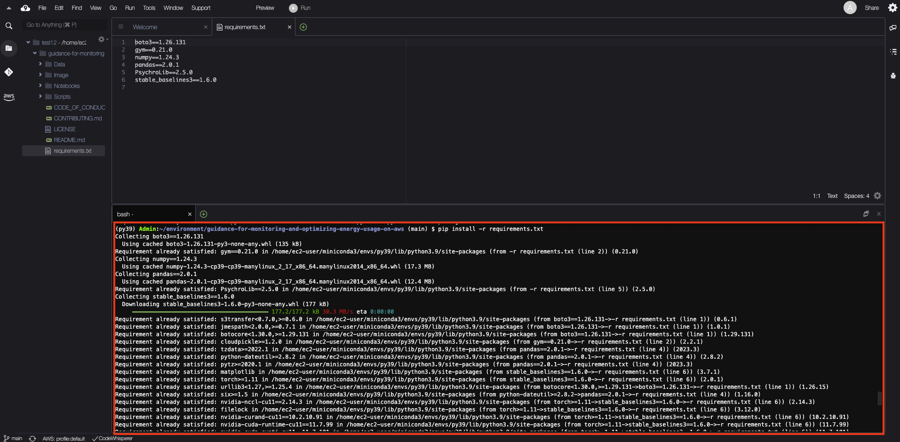
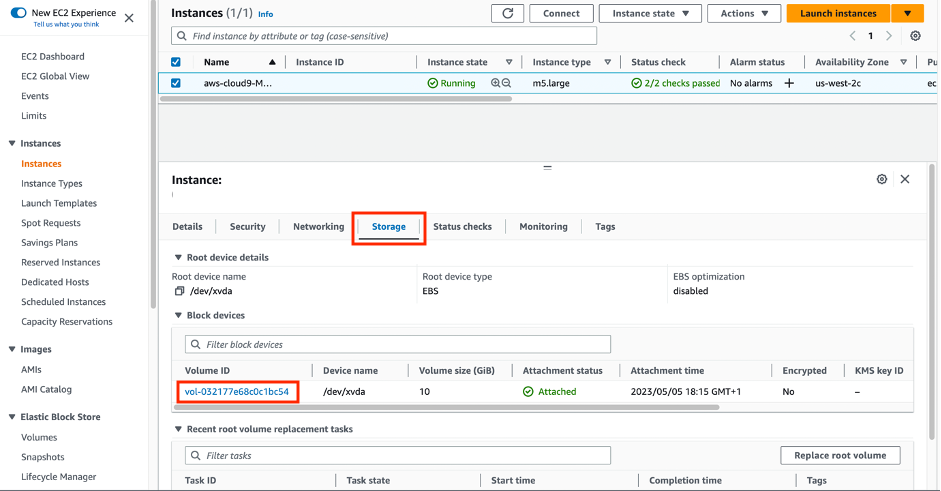
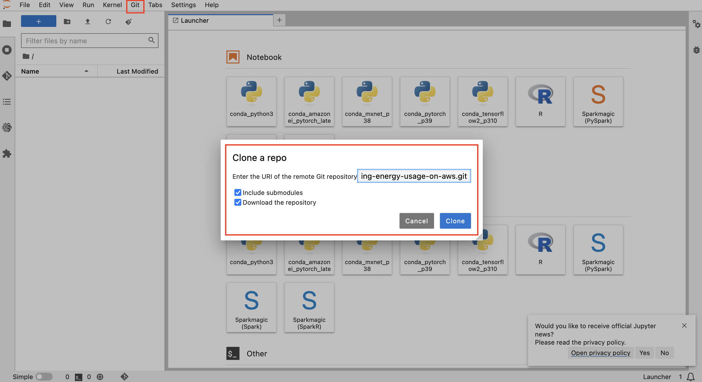

## Guidance for Monitoring and Optimizing Energy Usage on AWS

The sample code in this project demonstrates a Reinforcement Learning (RL) based solution to optimize energy usage on AWS. 

This RL-based solution can serve as a great starting point for optimizing energy usage for equipment with temperature and humidity sensor reading. You can further optimize this solution to fit your use case, and deploy on AWS to realize the cost saving.

This repository includes the Jupyter Notebook, and supporting code to run RL model for Monitoring and Optimizing Energy Usage on AWS, which can be readily deploy in step 5 of the . 

### RL solution workflow

### Project folder structure
- `Data` - contains synthetic data for this Energy Optimization RL demo
- `Image` - Image repo 
- `Notebooks` - contains ready to execute RL implementation in Jupyter Notebooks
- `Scripts` - contains RL implementation in .py files ready for immediate deployment

## Getting Started

The sample code is available in both Python script format as well as Jupyter Notebook.

Make sure you create an S3 bucket named `energy-optimization-demo-xxx` where xxx is replaced by any number 3 digit number as bucket names in Amazon S3 are globally unique. Within the bucket create a folder as `Model`. This is where the Reinforcement Learning model would be saved.

There are 2 options to experiment with the solution on AWS, the first one is through AWS Cloud9.

#### AWS Cloud9 Option
1.	Create a Cloud9 environment by deploying the [Cloudformation template](https://eu-west-1.console.aws.amazon.com/cloudformation/home?region=eu-west-1#/stacks/create) and upload the Cloud9.yaml from the Cloudformation folder.

2. Specify the Stack name and create the stack.

2.	Once the Stack is created succesfully, find the Cloud9 IDE URL under the output tab of CloudFormation, and clone the GitHub repository: 

`git clone https://github.com/aws-solutions-library-samples/guidance-for-monitoring-and-optimizing-energy-usage-on-aws.git`

3.	Follow the steps below to set up the environment within Cloud9 via the terminal:
    1. Downloads the latest Miniconda environment for Linux x86_64.  
      `wget https://repo.continuum.io/miniconda/Miniconda3-latest-Linux-x86_64.sh`
    2. Make the downloaded file executable.  
      `chmod a+x Miniconda3-latest-Linux-x86_64.sh`
    3. Run the Miniconda installer.  
      `./Miniconda3-latest-Linux-x86_64.sh`
    4. Close the terminal and Open a new terminal. Creates a new conda environment named py39 with Python version 3.9.  
      `conda create -n py39 python=3.9`
    5. Activates the py39 conda environment.  
      `conda activate py39`
    6. Navigate to the Guidance Directory.  
      `cd guidance-for-monitoring-and-optimizing-energy-usage-on-aws`
    7. Install the setuptools version 65.5.0.   
      `pip install setuptools==65.5.0`
    8. Installs the required Python packages listed in the requirements.txt file.  
      `pip install -r requirements.txt`

4.	Now that your environment is set up, execute the Python sample code.  
   1. Change your working directory to the `Scripts` folder.
      `cd Scripts`  
   2. Execute the script.
      `python3 train.py`

**Notes:**
1.	Replace the bucket name in the code, search for `energy-optimization-demo-xxx` and replace it with your own bucket name. 
2.	If you feel the installation takes time, try to increase the memory by following these steps, it helps to speed up the installation of stable_baselines3 library and training of the model.  
Go to the cloud9 name - Monitoring & Optimizing Energy Usage on AWS. Click on `Manage EC2 instance` and click on `volume ID` and modify the size of the EC2 volume. Reboot the EC2 instance.

  

  

  

  

#### Amazon SageMaker Option

1.	Create a Amazon SageMaker Notebook by deploying the [Cloudformation template](https://eu-west-1.console.aws.amazon.com/cloudformation/home?region=eu-west-1#/stacks/create) and upload the SageMakerJupyterNotebook.yaml from the Cloudformation folder.

2. Specify the Stack Name, S3 bucket Name and create the stack.

3.	Once the Stack is created succesfully, find the `Git` option on the menu bar and paste the Git repository URL: `https://github.com/aws-solutions-library-samples/guidance-for-monitoring-and-optimizing-energy-usage-on-aws.git`, then click `Clone`.

## Next Steps

This RL-based Energy Optimization model demonstrates value through optimizing the Economizer usage of the HVAC units based on `ZoneTemperature`, `ZoneHumidity`, `OutsideTemperature`, and `OutsideHumidity`. When replaced with actual telemetry data of these 4 sensors, the RL agent has achieved up to 5% reduction in power needed to sustain the same comfort level comparing to ASHRAE Standard 90.1-2013 setting, as shown below. 

We encourage you to take this RL framework, and tailor it to your use case. You can also embed the model into the reference architecture CDK stack that will be releasing in the near future.

## Cleanup
-	Delete the S3 bucket resources 
-	Delete the Cloudformation Stacks.

## Troubleshoot
1.	*`ERROR: Could not install packages due to an EnvironmentError: [Errno 28] No space left on device.`*  
Try to increase the storage space by following the above mention steps in notes section.

## Acknowledgement:
This work will not be possible with the contribution from the following authors:
- [Ivan Cui, Senior Data Scientist @ AWS](https://www.linkedin.com/in/jiarongivancui/)
- [Charles Prosper, Principal Applied Scientist @ AWS](https://www.linkedin.com/in/charles-prosper-9a580216a/)
- [Wei Yih Yap, Senior Applied Scientist @ AWS](https://www.linkedin.com/in/yapweiyih/)
- [Jake Chen, Senior Data Scientist @ AWS](https://www.linkedin.com/in/jakejchen/)
- [Jack Tanny, Data & ML Engineer @ AWS](https://www.linkedin.com/in/john-tanny/)
- [Jumana Nagaria, Associate Solution Architect @ AWS](https://www.linkedin.com/in/jumana-nagaria/)

## Security

See [CONTRIBUTING](CONTRIBUTING.md#security-issue-notifications) for more information.

## License

This library is licensed under the MIT-0 License. See the LICENSE file.
