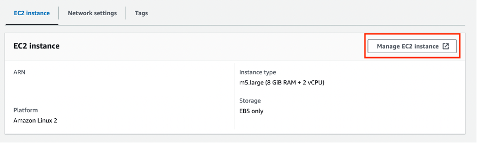

## Guidance for Monitoring and Optimizing Energy Usage on AWS

The sample code in this project demonstrate a Reinforcement Learning based solution on optimizing energy usage on AWS. 

This RL-based solution can serve as a great starting point for optimizing energy usage for equipment with temperature and humidity sensor readings. You can further optimize this solution to fit your use case, and deploy on AWS to realize cost saving.

### RL solution workflow

### Project folder structure
- `Data` - contains synthetic data for this RL demo
- `Image` - Image repo 
- `Notebooks` - contains ready to execute RL implementation in Jupyter Notebooks
- `Scripts` - contains RL implementation in .py files ready for immediate deployment

## Getting Started

The sample code is available in both python script format as well as Jupyter notebook.
Make sure you create an S3 bucket named `energy-optimization-demo-xxx` where xxx is replaced by any number 3 digit number as bucket names in Amazon S3 are unique across all existing bucket names. Within the bucket create a folder as `Model`. This is where the Reinforcement Learning model would be saved.

In order to use the python script in AWS, the following steps can be followed.
1.	Create a Cloud9 environment with the following details: 

- **Field Name:** Monitoring & Optimizing Energy Usage on AWS
-	**Environment type:** New EC2 Instance
- **Recommended Instance type:** m5.large (8 GiB RAM + 2 vCPU)

  Keep the rest default settings and create. It takes a while to load the environment.

2.	Once the cloud9 environment is ready, click on open cloud9 IDE. Clone the entire git repository:   

`git clone https://github.com/aws-solutions-library-samples/guidance-for-monitoring-and-optimizing-energy-usage-on-aws.git`

3.	In order to install the python libraries follow the steps in the terminal:
    1. Downloads the latest Miniconda environment for Linux x86_64.  
      `wget https://repo.continuum.io/miniconda/Miniconda3-latest-Linux-x86_64.sh`
    2. Make the downloaded file executable.  
      `chmod a+x Miniconda3-latest-Linux-x86_64.sh`
    3. Run the Miniconda installer.  
      `./Miniconda3-latest-Linux-x86_64.sh`
    4. Close the terminal and Open a new terminal. Creates a new conda environment named py39 with Python version 3.9.  
      `conda create -n py39 python=3.9`
    5. Activates the py39 conda environment.  
      `conda activate py39`
    6. Navigate to the Guidance Directory.  
      `cd guidance-for-monitoring-and-optimizing-energy-usage-on-aws`
    7. Installs the required Python packages listed in the requirements.txt file.  
      `pip install -r requirements.txt`

4.	Run the python sample code.  
   `cd Scripts`  
   `python3 train.py`

**Notes:**
1.	Replace the bucket name in the code, search for `energy-optimization-demo-xxx` and replace it with your own bucket name. 
2.	If you feel the installation takes time, try to increase the memory by following these steps, it helps to speed up the installation of stable_baseliness3 library and training of the model.  
Go to the cloud9 name - Monitoring & Optimizing Energy Usage on AWS. Click on `Manage EC2 instance` and click on `volume ID` and modify the size of the EC2 volume. Reboot the EC2 instance.

  

  

  

  

In order to use the notebooks in AWS, the following steps can be followed.
1.	Create Amazon SageMaker Domain with Quick setup. Wait for the domain to be ready.  

2.	Once the domain is ready, click on it and `Launch the SageMake Studio.`

3.	Select `Git` on the menu bar and click on `Clone Git Repository`. Paste the Git repository URL: `https://github.com/aws-solutions-library-samples/guidance-for-monitoring-and-optimizing-energy-usage-on-aws.git` and clone.

4.	Open the Jupyter Notebook and set up the notebook environment as follows:
-	**Instance type:** ml.m5.large

## Cleanup
-	Delete the S3 bucket resources 
-	Delete the Cloud9 environment if using python Script.

-	Terminate the running instances from SageMaker Studio if using Jupyter Notebooks.

## Troubleshoot
1.	*`ERROR: Could not install packages due to an EnvironmentError: [Errno 28] No space left on device.`*  
Try to increase the storage space by following the above mention steps in notes section.

## Security

See [CONTRIBUTING](CONTRIBUTING.md#security-issue-notifications) for more information.

## License

This library is licensed under the MIT-0 License. See the LICENSE file.